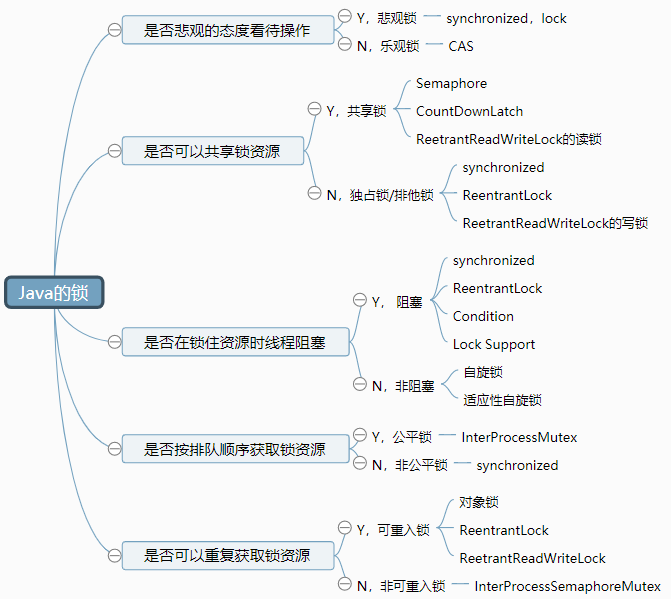

# 锁的分类

​		开始之前，先来回忆一下自己锁知道的锁有什么？可以的话，把它们罗列出来，并分析梳理它们之间的关系。例如我，首先想到的是synchronized，它关于锁的字眼就很多了，如锁的升级过程（无锁-偏向锁-轻量级锁-自旋锁-重量级锁），从特性上看可以是可重入锁，不可中断锁，非公平锁，独占锁，阻塞锁和悲观锁，还有对象锁，类锁。从数据库上看的时候，比如MySQL会有行锁，表锁，共享锁，排他锁，意向共享锁（IS锁）和意向排他锁（IX锁）等等。

​		那么锁的分类到底有多少种，我想很难给出一个标准的答案，不同业务里会有不同的要求，如果有人给这类业务场景定义了一个标准，便又诞生了新的锁。如果可以，同心锁是不是锁呢。废话结束讲正事，这些锁的特性往往的基于一种业务要求而诞生的，所以分类的话，就看从什么角度区分了。讲这么多，主要也想说明靠强记是很累的。下面是一张脑图，基于一些主要类型进行分类：




下面是对其中的概念进行解释：

- 悲观锁/乐观锁：

  

- 共享锁/独占锁：

  

- 阻塞锁/非阻塞：

  

- 公平锁/非公平锁：

  

- 可重入锁/可重入锁：

  


# 分布式锁的背景


# 基于Zookeeper的分布式锁


# 基于Redis的分布式锁

Redis是基于AP实现的NoSQL，这个是很重要的点，在考虑异常问题的时候，这是不能忽略的。

**Redis的实现分布式锁的基本原理**：

利用 `Key唯一性` 和 `Key过期` 实现的。`Key唯一性` 作为锁资源处理互拆性，`Key过期`是处理死锁问题。

在早期的redis版本中，redis实现分布式锁主要利用`setnx`指令。该指令的作用是只在键 `key` 不存在的时， 才将键 `key` 的值设置为 `value` 。如果 `key` 已经存在， 则 `SETNX` 命令不做任何动作，且该指令是原子性的。

下面操作过程：

```sh
redis> setnx lock 110    # key=lock，不存在时
1
redis> setnx lock 110    # key=lock，存在时
0
redis> ttl lock          # 查询key=lock的过期时间
-1
```

认真思考，该指令存在一个致命问题：**无法设置key的过期时间**，**会存在死锁的情况**。

解决方案：再获取到了锁资源后，再通过`expire`指令设置过期时间来避免死锁的情况。伪代码如下：

```java
int result = redisService.setnx(key,value)
if(result == 1) {
    redisService.expire(key)
    // todo
}
```

该方案似乎解决了问题，但是又引入了新的问题，`setnx`与`expire`两个指令在操作的过程中**无法保证原子性**。在`setnx`指令执行成功后，此时客户端挂了，`expire`就无法执行了，死锁的情况依然会发生。真是头大，那我们应该怎么解决这个问题呢？

开头的时候说了，上述的问题是存在于早期redis版本中的，在redis2.6.12版后，就把`setnx`与`expire`整合到了`set`指令中了，对开发来说真的太好了。下面介绍一下set的指令：

```sh
set key value [EX seconds][px millisecondes][nx|xx]
```

| EX seconds       | 设置键过期的时间为秒             |
| :--------------- | -------------------------------- |
| px millisecondes | 设置键过期的时间为毫秒           |
| nx               | 只在key不存在时，才对key进行操作 |
| xx               | 只在key存在时，才对key进行操作   |

如此一来，redis实现分布锁的问题就都基本解决了，伪代码可以如下：

```java
int result = redisService.set(key, value, timeout, TimeUnit, nx)
if(result == 1) {
    // todo
}
```

如果此时你以为结束了，那就太天真了。假设仅仅考试单机部署的时候，怎么设置时间就是一个很大的问题，如设置key的过期时间是10秒，业务实际执行时间是20秒，超出key过期时间，其他人又获取到了锁，此时是算锁失效吗。如果把锁的时间放大，万一获取锁的客户端在执行不久挂了，其他客户端是不是需要等待很长的时间，此时这块业务就变成了不可用了。

以上只是问题的冰山一角，还有很多的问题要一步一步来进行剖析。

# Zookeeper与RediK实现的对比
