# 分布式锁的背景

​		在单机时代，其实是不需要分布式锁的。随着业务的发展和数据的上升，系统变得越来越庞大，随之到来是现在盛行的微服务/分布式架构系统，用来解决单机系统的问题。简单的说，是将单机系统“分而治之”了，将一个系统拆分成若干个子系统，最后再组合形成一个整体。这么处理的好处有很多，但凡是具有两面性，带来的系统实现复杂度也必然上升了。以前不存在的问题，随着新架构的诞生而诞生了，其中分布式锁是其中之一。既然在分布式架构里需要分布式锁，我们就要了解其中的原因了，才能更好的去理解问题，解决问题。

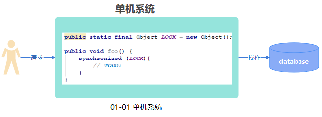

​        首先我们看单机系统，顾名思义，所有的代码，功能，业务都在一个系统里完成的。那么要要实现锁的功能就很简单的，比如Java系统，可以通过`synchronized`等方式实现，它的锁资源可以是一个全局的对象，如图01-01 单机系统所示。一个对象的对象锁只能同时被一个线程锁所持有，这句话所表达的最重要信息是`互斥性`，这也是锁的核心。

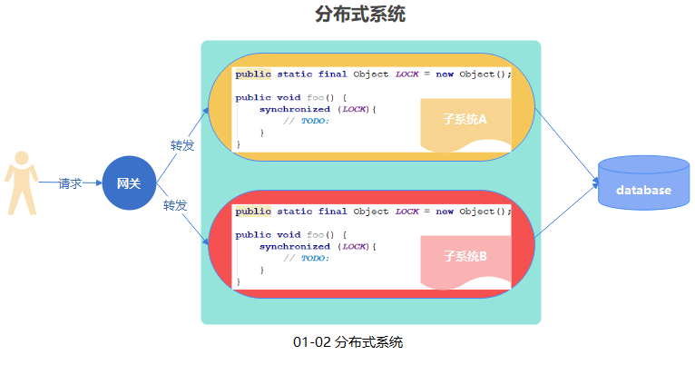

​       现在到了分布式系统架构，有`子系统A`和`子系统B`，依然通过`synchronized`去实现锁的功能。我们会发现，在分布式架构系统里，`synchronized`不能再起绝对的作用了。这是为什么呢，我们来分析一下。假设用户的请求涉及到需要加锁的全部发送到`子系统A`进行处理，那么`synchronized`是依然可以发会作用的。但是会存在很大的风险，一旦`子系统A`挂了，那么该操作将不再提供服务了，换言之系统是不可用了的。一般来说，为了避免这种现象都会将子系统弄成集群，`子系统A`与`子系统B`是两个相同的服务。用户涉及到加锁的请求就会发送到两个系统中，此时对`子系统A`与`子系统B`的`synchronized`来说，它们的锁对象是各自的对象，这样它们各自无法锁住彼此的操作了。两个请求分别同时到达了`子系统A`与`子系统B`，按道理这两个请求应该是只有一个先执行完释放锁后，另一个请求才能执行的，而现在显然做不到了。这里说了那么多，只想表达清楚，类似`synchronized`这种单机系统的锁在分布式架构中，是实现去锁的灵魂——`互斥性`。

​		还有一点，单独拿出来讲是希望大家可以清楚知道，单机系统的锁->分布式锁，它们的锁资源是由全局对象转化为请求资源。换句话说，在分布式锁中，**请求是作为了锁资源**。

## 分布式锁的特性

​		既然单机的锁无法用了，那么我们应该怎么实现分布式锁呢？首先一点就是一定要保证`互斥性`，而这个互斥性在单机系统里可以通过一个全局对象实现，因此我们的分布式锁可以参考全局对象的方案实现一把，这样的话，必然需要引入一个`全局的组件`来调控。这个组件可以是Redis，Zookeeper，数据库Oracle，MySQL等。问题肯定不止那么少，我们知道`synchronized`里是不可中断的锁，还有就是它不会出现`死锁`，除非自己的实现代码有问题，硬是要写死循环。另外，`synchronized`在释放锁的时候，是怎样的呢？那就是谁上的锁，谁来释放，因此我们要保证锁的`安全性`，不能是个人都可以释放锁。

​	基于上面的话，总结出了3个主要的特性：

1. `互斥性`——同时仅一个请求获取到了锁，其他请求只能是它释放后才能获取。
2. `避免死锁`——业务代码正常执行或者异常了，可以释放锁，避免死锁导致程序不可用。
3. `安全性`——谁上锁，谁解锁，应由同一个对象完成。

这里有些地方会提到`容错`，本人认为也没有错，但是这里更应该是分布式组件实现的功能，而不应该的分布式锁实现的功能。分布式锁是在它的基础上实现的，如果本身不支持容错，那么分布式锁去实现容错，实现的对象是否主次颠倒了呢？另外，锁的特性还有很多，大家可以根据各类锁的特性一一了解实现。比如，公平锁，重入锁，读写锁，自旋锁，共享锁等等。下面分享一张关于锁的分类，如图01-03。

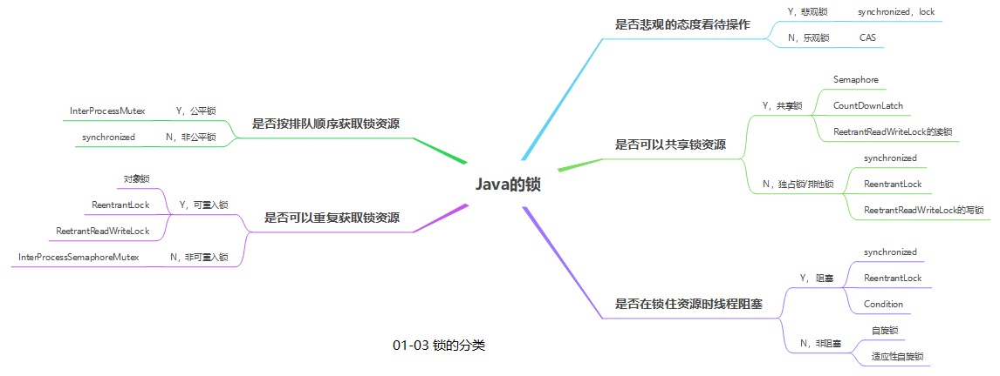

现在主流实现分布式锁的中间件主要是以`Zookeeper`和`Redis`中间件为主。下面对它们两个进行简单的讲解。

# 基于Zookeeper的分布式锁

​		Zookeeper是一个分布式的分布式应用程序协调服务，如果从字面去理解它的意思，其实挺抽象的。由于这里是讲解分布式锁的，所以我们可以把它理解成一种NoSQL，可以存储数据的一种中间件。这么一来就很好理解它实现分布式锁的过程了。

​		Zookeeper的数据是像种一样的结构，亦或可以理解像文件夹和文件一样的结构。如图01-04所示。如果理解成文件系统，就很好理解了。我们知道同一个文件夹下面，是不允许存在两个相同的文件的。除此之外，文件系统里还有一些临时的文件的。同样地，在Zookeeper里也很好的匹配了这一特性。Zookeeper，在同一个路径下不允许存在两个相同的节点，这里就体现了`互斥性`，恰好满足了锁最重要的特性。另外，Zookeeper的数据节点可以分为`持久节点`和`临时节点`，其中临时节点会随着创建它的客户端销毁而销毁，我们可以利用它处理死锁问题。两个重要的因素Zookeeper都满足了，至于锁的`安全性`，则应该由实现来完成的。还有，Zookeeper提供了`watch机制`，也就是监听，客户端可以监听一个节点的一些事件，通过事件可以完成很多的事情的。借助该机制，我们又多了一些灵活的处理了。

​		另外有一个很重要的点，Zookeeper是基于`CAP理论`种的`CP`实现的分布式组件，这意味着Zookeeper是追求一致性的，无论是单机还是集群，都可以看成是一个服务了。这点很重要，后面用于对比Redis的时候，这会是重点。

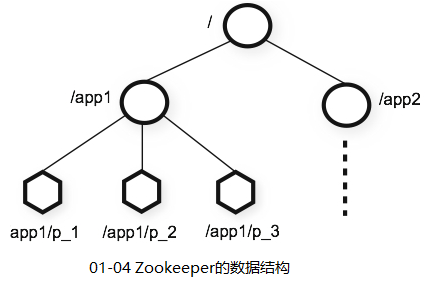

下面介绍Zookeeper的关键命令

`create [-s] [-e] path data`

-s 顺序节点

-e 临时节点

path 节点的路径

data 节点的数据

上文说过，Zookeeper的节点数据是具有`互斥性`的，下面节点的演示一下。我们在`/`路径下创建一个`demo`节点，数据为`mydata`，然后再创建一次，会发现Zookeeper会告诉我们节点已经存在了，如图01-05所示。

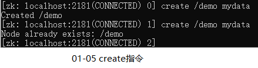

`stat path [watch]`

path 节点的路径

watch 是否监听

演示需要两个客户端，同样我们利用刚刚创建节点`/demo`进行演示，一个先添加监听事件，然后另一个再删除`/demo`节点，添加了监听该节点客户端会收到节点被删除的消息。如图01-06所示。

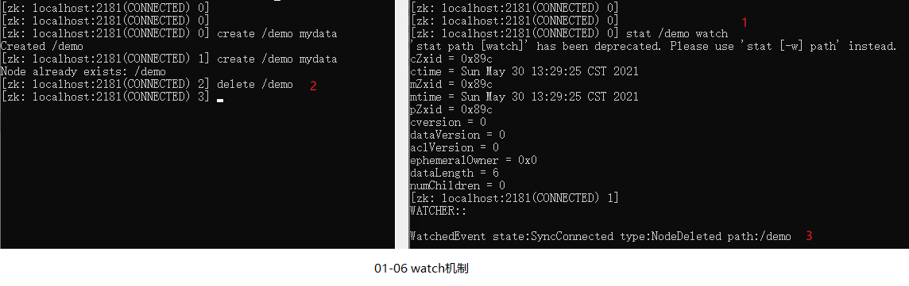

通过Zookeeper这几个特性，下面我们实现分布式锁的思路就基本有了，下面更具图01-07进行讲解。

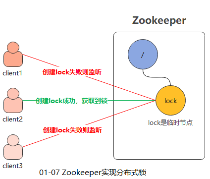

​		假设现在有3个客户端需要获取lock资源的锁，他们同时去创建，谁创建成功了也就谁获取到了分布式锁，其他的失败后则监听lock资源。这里是client 2拿到了，当client 2执行完业务或异常时，则删除lock节点的时候，也释放锁资源。然后，Zookeeper会通知client 1和client 3。client 1和client 3会再去重复上述的过程。

​		由于lock节点是临时节点，如果client 1在业务的时候，突然挂了，删除lock节点的动作是无法进行的。此时临时节点就发挥了它的作用了，它会跟随client 1而销毁。随之，监听lock状态的客户端们会收到锁资源被释放的消息，又重新发起获取锁的请求，依次重复。

​		简单的看，该实现没有什么问题，但是如果在并发情况里会有种现场。假设现在一堆的请求来获取锁，然而仅仅只有一个获取到，其他的只能等待。当锁资源被释放的时候，又将唤醒一堆的线程。这种现象好不好呢？不好，这样对应用来说，波动太大了。如果把应用比如公园里的鱼池，鱼池里的锦鲤是线程，我们希望鱼池是平静的，平稳的，那么我们投喂的时候，就希望锦鲤们一条一条按顺序来吃食，而不是一哄而上，把鱼池弄得一趟浑水。我们也是希望我们的应用也应该如此的，所以要对实现再进行改造，让它对系统友好些。刚刚描述的现象，再业界里有个术语是`羊群效应`，亦或者是`惊群效应`。其实本质上，是`非公平锁`表现的，我们想想要的`公平锁`的实现。


​		这个一个新的方案，与上一个方案做了小小改动。首先，锁的资源不再是lock，而是lock下面的子节点，只有成为`最小的lock子节点`，该能成为锁资源，也就是获取到了锁资源了。客户端方面，也不再监听lock节点了，是改为了如果判断自己不是最小的子节点，则监听自己它创建的小的上一个子节点。这样做，有什么好处呢？想想过程就知道了，当锁资源被释放后，唤醒的是多少个客户端？是一个，就是比锁资源小的下一个子节点的客户端创建者。以此来推，这样一来，是不是对应用很友好了，而这种恰恰是`公平锁`的实现。

​		即使如果中间某个节点消失了，也不会影响锁的失效，因为我们设定的原则是`最小的子节点`才能是获取到锁。例如，lock-1，lock-2，lock-3，当lock-2挂了，client 3会被唤醒，那么client 3会获取到锁吗？不会，因为前面还有一个lock-1。当唤醒的时候，client 3进行判断即可，然后再改变监听的对象就好了。有人会问，如果发起监听事件时，恰好lock-1被删除了，此时改为监听lock-1的client-3不是永远在监听，不被唤醒了吗。非也，我们可以做个实验，还是利用`/demo`节点。根据上面的操作，我们知道`/demo`已经被删除了，那我们再发起监听看看。如图01-09所示。我们发现，被提示为“*Node does not exist: /demo*”，如此以来自己又变成了获取到锁了。

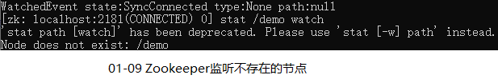

基于Zookeeper实现的新方案，其实第三方Zookeeper客户端Curator已经实现了。我们可以选择自己再造一轮子，也可以选择学习别人是如何实现的刚刚的方案的。下面进行简单的代码分享吧。

## Curator的分布式锁

### demo

Curator的使用也很简单，同样的，使用分布式锁也很简单，下面的简易版的展示。

```java
@Slf4j
public class CuratorLockTest {
    public static void main(String[] args) {
        // 初始化客户端
        String connectString = "127.0.0.1:2181";
        int sessionTimeoutMs = 5000;
        int connectionTimeoutMs = 5000;
        int retryCount = 5;
        int sleepMsBetweenRetries = 5000;
        CuratorFramework client = CuratorFrameworkFactory.newClient(
                connectString, sessionTimeoutMs, connectionTimeoutMs,
                new RetryNTimes(retryCount, sleepMsBetweenRetries));
        // 启动客户端
        client.start();

        // 分布式锁
        InterProcessMutex lock = new InterProcessMutex(client, LockConst.ZK_LOCK);
        try {
            lock.acquire();
            log.info("执行业务代码");
        } catch (Exception e) {
            e.printStackTrace();
        } finally {
            if (lock.isAcquiredInThisProcess()) {
                try {
                    lock.release();
                } catch (Exception e) {
                    e.printStackTrace();
                }
            }
        }
    }
}
```

### 源码解读

// 待续...

源码解读分三步走，分别是创建InterProcessMutex，lock.acquire()和lock.release()三步。

#### new InterProcessMutex

#### lock.acquire()

#### lock.release()

# 基于Redis的分布式锁

​		前面说了，Zookeeper是基于CAP理论中的`CP`实现的，作为对比的另一门技术Redis，自然而然是基于`AP`实现的了。也正因如此，利用Redis实现分布式锁的时候，需要关注的问题将非常多。

​		下面简单介绍Redis，Redis的英文全称是*Remote Dictionary Server*，同时是采用K-V类型实现的中间件，很想我们平时使用的Map。数据结果类型如图01-10所示。

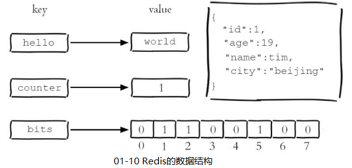

​		那么如何利用Redis实现分布式锁呢？其实有很多种方案，总结一下就是`实现key的唯一性`和`利用key的过期事件/value作为过期时间值`，通常来说，维护key的唯一性和利用expire实现是比较常用的做法。下面基于该方案进行讲解，过程比较长，希望大家耐心看完。

​		第一步很重的是，实现key的唯一性，我们知道，Redis中set，hset等是没有互斥性的，如果存在该key的数据的时候，再进行设置会直接覆盖的。如图01-11所示

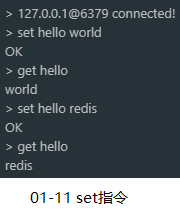

​		看到这样的结果该如何是好呀，不用担心，基于Redis实现的分布式锁早就有，下面以历史的角度，一步一步看利用Redis实现分布式锁的历程，了解其中的坑。

**版本一**：利用setnx指令

​		虽然set命令不能提供互拆性，但是setnx是具有互斥性的。该指令的作用是只在键 `key` 不存在的时， 才将键 `key` 的值设置为 `value` 。如果 `key` 已经存在， 则 `SETNX` 命令不做任何动作，且该指令是原子性的。正好可以利用它来实现锁的互斥性，如图01-12是setnx指令的操作过程。以及利用RedisTemple实现的代码。

​																	 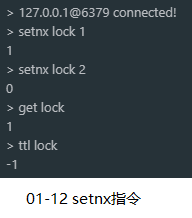

​		

```java
public void v1() {
    String lock = "LOCK_KEY";
    Boolean absent = redisTemplate.opsForValue().setIfAbsent(lock, "LOCK_VALUE");
    if (absent) {
        try {
            log.info("执行业务代码"); 
        } finally {
            // 删除LOCK_KEY，防止死锁
            redisTemplate.delete(lock);
        }
    } else {
        log.error("获取锁失败");
    }
}
```

问题：如图01-12所示，lock是没有过期时间的，如果代码在`执行业务代码`里挂了，此时的锁将成为死锁，这点就犯了分布式锁的致命问题了。当然还有其他的问题，这里不展开，各位想的越多自然越好，说明越了解。

**版本二**：利用setnx指令+expire指令

​		针对`版本一`的问题，我们可能会想，既然没有过期时间，那么我们加一个设置过期时间的操作不就得了吗。这么一来，我们的版本二实现就诞生了。利用`expire`指令设置key的过期时间。

```java
public void v2() {
    String lock = "LOCK_KEY";
    Boolean absent = redisTemplate.opsForValue().setIfAbsent(lock, "LOCK_VALUE");
    if (absent) {
        try {
            // 设置过期时间
            redisTemplate.expire(lock, 10L, TimeUnit.SECONDS);
            log.info("执行业务代码");
        } finally {
            // 删除LOCK_KEY，防止死锁
            redisTemplate.delete(lock);
        }
    } else {
        log.error("获取锁失败");
    }
}
```

​		问题：这里的代码逻辑是没有问题的，但是犯了一个致命的问题，设置key的操作和设置key的过期时间操作不是原子性的，假设在设置`setIfAbsent`结束后，在执行`expire`前，应用挂了，此时的锁又成了死锁了，问题依然没有解决。

**版本三**：利用升级版的set命令

​		是否郁闷了，小小的问题两个版本还没有解决。不慌！在Redis 2.6.12版本后，Redis对`set`命令进行了升级，将`set`与`expire`命令进行了整合，变成了加强版的`set`命令了。下面的`set`命令的说明：

```shell
set key value [EX seconds][px millisecondes][nx|xx]
```

| 参数             | 说明                             |
| :--------------- | -------------------------------- |
| EX seconds       | 设置键过期的时间为秒             |
| px millisecondes | 设置键过期的时间为毫秒           |
| nx               | 只在key不存在时，才对key进行操作 |
| xx               | 只在key存在时，才对key进行操作   |

具体的指令操作就不示范了，下面展示Java的示范代码。

```java
public void v3() {
    String lock = "LOCK_KEY";
    Boolean absent = redisTemplate.opsForValue()
        .setIfAbsent(lock, "LOCK_VALUE", 10L, TimeUnit.SECONDS);
    if (absent) {
        try {
            log.info("执行业务代码");
        } finally {
            // 删除LOCK_KEY，防止死锁
            redisTemplate.delete(lock);
        }
    } else {
        log.error("获取锁失败");
    }
}
```

到这一步可算是把死锁的问题解决了，但是别开心的太早，还有其他的问题呢。

问题：第一个看到的应该给是设置过期时间的问题了，就是如果`执行业务的时间`大于`锁过期的时间`，那么是不是分布式锁存在问题呀。这里还有另一个更隐蔽的问题，就是删除锁的时候，存在误删的情况。简言之，不是我创建的，但是被我删除了。

场景如下：线程A获取到了锁并设置锁10秒后过期，但是 因为执行业务代码时间需要15秒。在10秒后，锁过期了，线程B又获得了锁，线程B执行业务需要的时间可能是10秒。在5秒过后，线程A执行完业务代码了，此时它要去删除锁。此时的锁是谁创建的呢？——线程B。线程A直接就删除了锁，如果此时还有线程C，那么线程C也必然是拿到了锁。问题就来了，同时有两个线程获取到了锁。首先违背了`互斥性`，其次，`安全性`也丢失了。我们要解决该问题才行。


提示: 除了利用`set`指令实现这个版本的功能外，我们还可以利用Lua脚本实现。因为一条Lua脚本在执行多个命令的时候，是具有**原子性**的，这个是很重要的一点，下面还会提及。

**版本四**：处理误删锁的问题

​		上一个版本分析了误删锁的问题，下面就是解决问题的时候。开头我们讲到，分布式锁的锁资源是请求，在Redis中，我们只用了Key，Value似乎没有用到。说到这，你的灵感来了吗？我们可以利用Value来作为谁创建锁的表示，这样再删除的时候判断一下，就不会误删了，方案是不是很明确了呢？

​		实现该功能，有2种方式。一个是利用Lua脚本，这里官网还提供了说。除此之外还可以利用Redis的事务。下面一一对其实现一下吧。

**版本四.一：**利用Lua脚本

首先放出官方解释的链接 [distlock](https://redis.io/topics/distloc)，脚本如下：

```lua
if redis.call("get",KEYS[1]) == ARGV[1] then
    return redis.call("del",KEYS[1])
else
    return 0
end
```

我的代码实现如下，简单的解释一下逻辑。

首先利用`UUID`和线程名称作为Value，同时保证唯一性。当业务代码执行完毕的时候，在删除锁的操作利用Lua脚本处理。Lua脚本的逻辑是先取值判断是否等于我的Value，如果等于则进行删除操作，如果不等于则返回0。

```java
public void v4_1() {
    String lock = "LOCK_KEY";
    // 保证value的唯一性
    String value = UUID.randomUUID().toString() + "_" + Thread.currentThread().getName();
    Boolean absent = redisTemplate.opsForValue()
        .setIfAbsent(lock, "LOCK_VALUE", 10L, TimeUnit.SECONDS);
    if (absent) {
        try {
            log.info("执行业务代码");
        } finally {
            // lua脚本
            String scriptString = "if redis.call('get', KEYS[1]) == ARGV[1] "
                + "then "
                + "    return redis.call('del', KEYS[1]) "
                + "else "
                + "    return 0 "
                + "end";
            // 创建RedisScript对象，用于执行lua脚本
            DefaultRedisScript script = new DefaultRedisScript();
            script.setScriptSource(new StaticScriptSource(scriptString));
            script.setResultType(String.class);

            // 对应的是KEYS[1]
            List<String> keys = Collections.singletonList(lock);

            // 对应的是ARGV[1]
            List<String> argv = Collections.singletonList(value);

            Object execute = redisTemplate.execute(script, keys, argv);
            if ("1".equals(execute.toString())) {
                log.info("删除锁成功");
            } else {
                log.info("删除锁失败");
            }
        }
    } else {
        log.error("获取锁失败");
    }
}
```

**版本四.二：**利用Redis的事务

​			首先简单介绍一下Redis的事务，Redis的事务通过MULTI开始，EXEC执行，中间还有DISCARD，WATCH和UNWATCH命令。我们知道Redis的单个命令都是原子性的，但是多个并不是，前面也提到了。在Redis的事务种，会确保事务性的对象是命令集合，Redis会将命令们序列化后处理一个事务里，确保是连续不被打断的执行。还有一点，Redis事务是不支持回滚。

| 指令              | 说明                                                         |
| ----------------- | ------------------------------------------------------------ |
| MULTI             | 标记一个事务块的开始                                         |
| EXEC              | 执行所有事务块内的命令                                       |
| DISCARD           | 取消事务，放弃执行事务块内的所有命令                         |
| WATCH key [key …] | 监视一个或多个key ，若在事务执行前key被其他命令所改动，事务将被打断 |
| UNWATCH           | 取消 WATCH 命令对所有key的监视                               |

实现的代码如下，与Lua脚本基本一致，不同的是利用事务的特性进行了删除操作。

```java
public void v4_2() {
    String lock = "LOCK_KEY";
    // 保证value的唯一性
    String value = UUID.randomUUID().toString() + "_" + Thread.currentThread().getName();
    Boolean absent = redisTemplate.opsForValue()
        .setIfAbsent(lock, "LOCK_VALUE", 10L, TimeUnit.SECONDS);
    if (absent) {
        try {
            log.info("执行业务代码");
        } finally {
            while(true){
                redisTemplate.watch(lock);
                // 判断值是否符合预期
                String result = redisTemplate.opsForValue().get(lock);
                if(value.equals(result)){
                    redisTemplate.setEnableTransactionSupport(true);
                    redisTemplate.multi();
                    redisTemplate.delete(lock);
                    List<Object> list = redisTemplate.exec();
                    if (list == null) { // 执行失败则继续
                        continue;
                    }
                }
                // 执行成功，取消监听，推出循环
                redisTemplate.unwatch();
                break;
            }
        }
    } else {
        log.error("获取锁失败");
    }
}
```

​		到这里可算了又填了一个坑，但是我们发现还有一个时间的问题尚未处理，就是`执行业务时间`与`锁过期时间`的问题。如果想通过加长锁的过期时间来处理的话，一旦出现程序话了，那么很长的一段时间必然是功能不可用的，这点与死锁有何区别。还有，即使再长，也一定保证是大于业务执行时间吗？不一定吧。

​		由于分布式锁的问题太多了，下面就直接引入Redisson客户端进行处理吧，看看别人是怎么造的轮子。

**版本五**：利用Redisson实现

​		首先来看看怎么使用Redisson的分布式锁，代码如下：

```java
public void redissonLock() {
    // 创建客户端
    Config config = new Config();
    config.useClusterServers().addNodeAddress("redis://127.0.0.1:6379");
    RedissonClient client = Redisson.create(config);

    // 获取锁
    RLock lock = client.getLock(LockConst.REDIS_LOCK);
    lock.lock();
    try {
        log.info("执行业务代码");
    } finally {
        // 保证锁不必误删
        if (lock.isLocked() && lock.isHeldByCurrentThread()) {
            lock.unlock();
        }
    }
}
```

​		代码其实很简单，主要注意的是删除锁时候的操作，要进行两次的判断，具体原因上述已经讲明了。

​		Redisson是怎么保证锁的过期时间会大于业务执行时间的呢？很简单，Redisson提供了一个watchdog的功能，watchdog会维护锁的过期时间，当锁的时间执行到了1/3的时候，watchdog将重新给锁延期。以此类推，保证了锁的不会在业务执行完之前过期的。

​		Redisson具体的实现代码如下：

```java
private void renewExpiration() {
    RedissonLock.ExpirationEntry ee = (RedissonLock.ExpirationEntry)EXPIRATION_RENEWAL_MAP.get(this.getEntryName());
    if (ee != null) {
        Timeout task = this.commandExecutor.getConnectionManager().newTimeout(new TimerTask() {
            public void run(Timeout timeout) throws Exception {
                RedissonLock.ExpirationEntry ent = (RedissonLock.ExpirationEntry)RedissonLock.EXPIRATION_RENEWAL_MAP.get(RedissonLock.this.getEntryName());
                if (ent != null) {
                    Long threadId = ent.getFirstThreadId();
                    if (threadId != null) {
                        RFuture<Boolean> future = RedissonLock.this.renewExpirationAsync(threadId);
                        future.onComplete((res, e) -> {
                            if (e != null) {
                                RedissonLock.log.error("Can't update lock " + RedissonLock.this.getName() + " expiration", e);
                                RedissonLock.EXPIRATION_RENEWAL_MAP.remove(RedissonLock.this.getEntryName());
                            } else {
                                if (res) {
                                    RedissonLock.this.renewExpiration();
                                }

                            }
                        });
                    }
                }
            }
        }, this.internalLockLeaseTime / 3L, TimeUnit.MILLISECONDS);
        ee.setTimeout(task);
    }
}
```

`this.internalLockLeaseTime / 3L`是时间间隔，`internalLockLeaseTime `对应的是设置锁的过期时间，默认是30秒。


你以为到这一步，就结束了吗，告诉还没有结束。

问题：刚刚的模式是基于单机部署的Redis，如果是主从部署的呢？还记得开头说的Redis在CAP理论采用的AP策略，那么在集群部署的时候，就存在问题了。为了方便理解，假设是一主一从的部署吧。

过程如下：

1.线程A写入锁到主节点成功，线程A获取到锁执行业务代码的时候，主节点挂了。

2.主节点是在写入锁后，再同步数据到子节点前挂的。

3.子节点变成了主节点了，新的请求又过来了，是线程B。

4.线程B请求Redis，在主节点(原本的子节点)中成功获取到了锁，因为之前没有同步成功。

5.此时线程A和线程B同时获取到了锁，互斥性又被打败了。

这个场景，我说明白了吗。

**版本六**：利用Redisson实现的RedLock

针对版本5的问题，Redis其实提供了RedLock算法去解决该问题，然而并不能完美的解决问题，在概率极小的情况下依然会出现的，不过思路还是值得学习的。关于这个问题，我想放在`Zookeeper与Redis的实现`对比中讲述。

首先还是展示代码吧：

```java
public void redLock() {
    // 创建客户端
    Config config1 = new Config();
    config1.useClusterServers().addNodeAddress("redis://127.0.0.1:6379");
    RedissonClient client1 = Redisson.create(config1);
    // 创建客户端
    Config config2 = new Config();
    config2.useClusterServers().addNodeAddress("redis://127.0.0.1:6389");
    RedissonClient client2 = Redisson.create(config2);
    // 创建客户端
    Config config3 = new Config();
    config1.useClusterServers().addNodeAddress("redis://127.0.0.1:6399");
    RedissonClient client3 = Redisson.create(config3);

    String lock = "LOCK_KEY";
    RLock lock1 = client1.getLock(lock);
    RLock lock2 = client2.getLock(lock);
    RLock lock3 = client2.getLock(lock);
    
    RedissonRedLock redLock = new RedissonRedLock(lock1, lock2, lock3);
    redLock.lock();
    log.info("执行业务代码");
    if (redLock.isLocked() && redLock.isHeldByCurrentThread()) {
        redLock.unlock();
    }
}
```

简述一下，RedLock算法的精髓：

​		在Redis的分布式环境中，假设有N个完全互相独立的Redis节点，在N个Redis实例上，使用与在Redis单实例下相同方法获取锁和释放锁。当客户端在N/2 + 1节点上获取到了锁，则算成功获取到了锁（相当于半数原则）。这样一来就可以避免某个节点宕机的风险了。正如上面的代码实现所示，不看源码就明白了这层逻辑了吧。

​		但是，即使如此，依然无法100的处理问题，例如一个线程获取到了锁，在执行业务代码的过程中遇到了Stop the world，或者网络波动等。RedLock利用时间避免死锁的特性，将存在风险了。除了这些，还有不同服务器之间的时间问题，也是要求同步才可以的，这意味着需要维护多一层的东西来保证功能正确。

​		关于这点，分布式系统的专家`马丁·克莱普曼博士(Martin Kleppmann)`与Redis的作者`Antirez`曾经对此进行过精彩的辩论。

## Redisson源码解读

// 待续...

# Zookeeper与Redis的实现对比

// 待续...